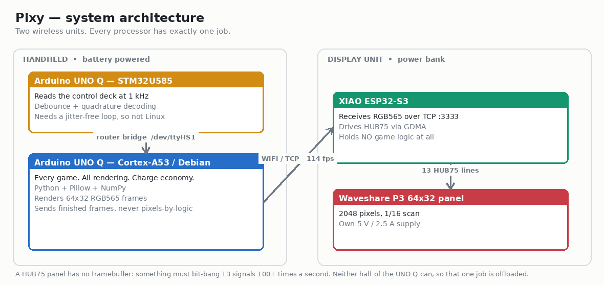
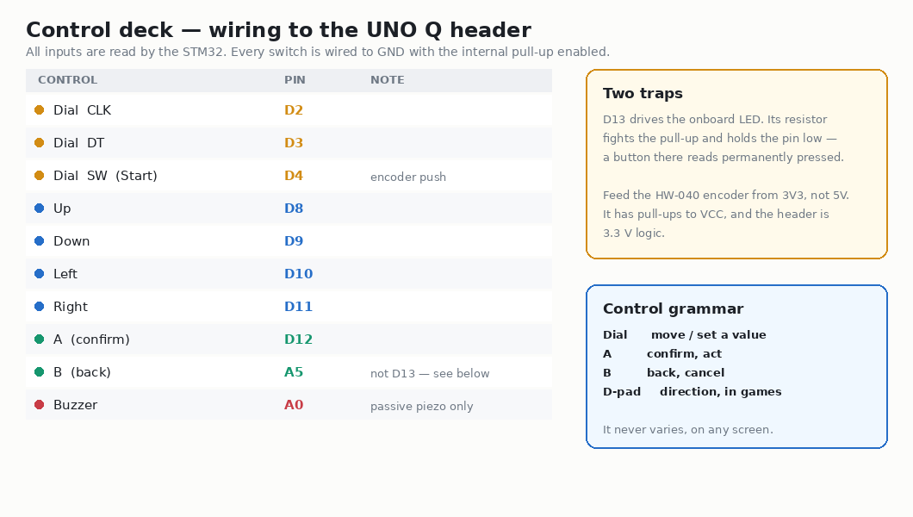
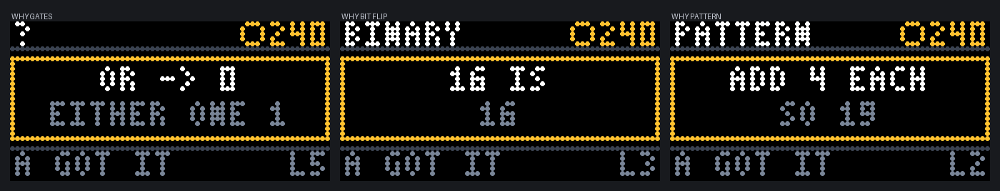

# Pixy — a handheld STEM console that runs on what you learn

**Solve engineering puzzles on a 64×32 LED matrix, bank the Charge you earn,
and spend it in the arcade. Two wireless units, built on the Arduino UNO Q —
and it uses both of its brains.**

> 📷 `docs/img/screens/console-home.jpeg` — the console, powered up
> 🎬 **VIDEO — upload `pixyvideo5.mp4` to YouTube and embed here.** Pattern
> solved, then a **LEVEL 2** promotion banner. It shows the adaptive system
> working in five seconds, better than any paragraph.

---

## Why I built this

Most STEM toys pick a side. Either they teach, and feel like homework with
LEDs on it — or they entertain, and the learning is a thin coat of paint over
a game the kid would rather just play.

Pixy makes the learning **the power source**. Every puzzle you solve pays
*Charge*. Charge is what unlocks the arcade — Breakout, Pong, Snake, Simon. A
kid who wants to play Pong gets there by working out gear ratios. That is the
entire design, and everything else follows from it.

Two decisions came out of that, and both went against my first instinct:

**Arcade unlocks are permanent, not pay-per-play.** Charging per play turns
learning into a toll booth, and a kid who runs short simply stops. A one-time
unlock gives you something to work toward that then keeps giving.

**Difficulty adapts per game, not globally.** A kid who has binary cold but
finds ratios hard should get hard binary and gentle ratios *at the same time*.
One global difficulty slider can only ever hold one back while overwhelming
the other.

---

## What it is

Two units that talk over WiFi, each with its own power.

| | |
|---|---|
| **Handheld** | Arduino UNO Q, the control deck, a battery. Runs every game. |
| **Display** | 64×32 LED matrix, XIAO ESP32-S3, a power bank. Draws what it is told. |

> 📷 `docs/img/screens/gates.jpeg` — Gate Keeper
> 📷 `docs/img/screens/gearlab-close.jpeg` — Gear Lab, both wheels turning
> 📷 `docs/img/screens/ohms-way.jpeg` — Ohm's Way

**Six learning games:** Gates (boolean logic), Bit Flip (binary), Pattern
(sequences), Ohm's Way (V = I × R), Gear Lab (ratios), Angle (degrees).

**Four arcade games:** Breakout (free), Simon (40 Charge), Snake (60),
Pong (80).

---

## How it works



Three processors, one job each.

| Processor | Job | Why this one |
|---|---|---|
| **STM32U585** (on the UNO Q) | Reads the control deck at 1 kHz | Quadrature decoding and debounce need a jitter-free loop. Linux userspace has no real-time guarantee. |
| **Cortex-A53 / Debian** (on the UNO Q) | Every game, all rendering, the Charge economy | Python, Pillow, real fonts, a real filesystem for save state. |
| **XIAO ESP32-S3** | Pixel pump for the panel | See below. |

### Why there is a third microcontroller

A HUB75 LED panel has **no framebuffer and no PWM**. Something must bit-bang
thirteen signals at 100+ full refreshes a second, with binary code modulation
layered on for colour depth. That needs DMA hardware or a dedicated real-time
core.

Neither half of the UNO Q has it. Linux userspace flickers, and the standard
Linux HUB75 library (`rpi-rgb-led-matrix`) pokes BCM2835 registers directly —
it is Raspberry Pi-specific. On the MCU side, Adafruit's Protomatter has no
STM32U5 backend; its STM32 support is gated on `#if defined(STM32F4_SERIES)`.

So that one job is offloaded to a XIAO ESP32-S3, which drives HUB75 over GDMA
at almost no CPU cost. **It holds no game logic whatsoever** — it receives
finished RGB565 frames and copies them to the panel. A display adapter,
exactly as you would use a dedicated driver IC.

Measured: **114 fps over WiFi**. A frame is 4096 bytes, so the link was never
the constraint.

---

## Parts

| Part | Qty | Notes |
|---|---|---|
| Arduino UNO Q | 1 | Debian image `20251111-426` or newer |
| Seeed XIAO ESP32-S3 | 1 | **the u.FL antenna is not optional** |
| Waveshare RGB-Matrix-P3-64×32 | 1 | 192 × 96 mm, 1/16 scan |
| EC11 / HW-040 rotary encoder | 1 | with push switch |
| 12 mm tactile switch | 4 | direction cluster |
| 6 mm tactile switch | 2 | A and B |
| Passive piezo buzzer | 1 | **passive** — an active one ignores the frequency |
| 5 V power bank, 2.5 A+ | 1 | display unit |
| Battery pack | 1 | handheld |
| Perfboard, jumper wire, M3 screws | — | |

**Tools:** soldering iron, multimeter, 3D printer (220 × 220 bed).

---

## Quick start

If you are comfortable with Arduino, this is the whole thing:

```bash
git clone https://github.com/lil-shan/pixy && cd pixy

# 1. Display unit — flash the XIAO
cp xiao_wifi/secrets.h.example xiao_wifi/secrets.h   # your 2.4 GHz SSID
arduino-cli compile --fqbn esp32:esp32:XIAO_ESP32S3 \
  --board-options USBMode=hwcdc -u -p /dev/ttyACM0 xiao_wifi

# 2. Handheld — flash the UNO Q's MCU
arduino-cli compile --fqbn arduino:zephyr:unoq -u -p /dev/ttyACM1 mcu/pixy_input

# 3. Copy the Python side to the UNO Q, then run it
scp -r host/* arduino@<uno-q-ip>:~/ledmatrix/
ssh arduino@<uno-q-ip> 'cd ledmatrix && ./pixy.sh start <xiao-ip>'
```

The panel shows its own IP on boot, so you never need a serial monitor to find
it. **The ESP32-S3 is 2.4 GHz only** — a 5 GHz SSID will never work, however
right the password is.

The detailed version follows.

---

## Build it, step by step

### Step 1 — Display unit: panel and XIAO

> 📷 `docs/img/build/02-xiao-antenna.jpeg` — XIAO with its antenna fitted

**Fit the antenna first.** The XIAO ESP32-S3 has no PCB antenna. There is a
small u.FL socket; the flexible antenna in the box clips onto it, pressed
straight down until it clicks. Without it the radio is deaf — see the bugs
section, because this cost me an evening.

HUB75 needs 13 signals. The XIAO has 11 edge GPIO plus four rear JTAG pads, so
the two least timing-critical lines go on the rear pads.

| HUB75 | XIAO | | HUB75 | XIAO |
|---|---|---|---|---|
| R1 | D0 · GPIO1 | | A | D6 · GPIO43 |
| G1 | D1 · GPIO2 | | B | rear `MTDI` · GPIO41 |
| B1 | D2 · GPIO3 | | C | rear `MTDO` · GPIO40 |
| R2 | D3 · GPIO4 | | D | D7 · GPIO44 |
| G2 | D4 · GPIO5 | | CLK | D8 · GPIO7 |
| B2 | D5 · GPIO6 | | LAT | D9 · GPIO8 |
| GND | GND | | OE | D10 · GPIO9 |

Pin 8 (E) is unused on a 1/16 scan panel — leave it disconnected.

**Finding pin 1 without labels:** HUB75 connectors rarely print signal names.
Set a multimeter to continuity, put one probe on the panel's ground terminal
and walk the other across all 16 pins. One column has **no** grounds — that is
the odd column, and pin 1 is at the end where the even column's ground is its
*second* pin.

**Power the panel from its own 5 V supply**, never from the XIAO's 5V pin, and
keep grounds common between the supply, the panel and the XIAO.

⚠️ **Power the panel first, then the XIAO.** Driving an unpowered panel
back-feeds it through the input ESD clamp diodes, lighting it dimly with
garbage and browning out the XIAO.

Flash `xiao_wifi`, and the panel will show `WIFI …` then its own IP address.

> 📷 `docs/img/build/05-wifi-connecting.jpeg` — the panel connecting

### Step 2 — Handheld: the control deck

> 📷 `docs/img/build/03-deck-perfboard.jpeg` — the deck on perfboard
> 📷 `docs/img/build/01-unoq-deck-wiring.jpeg` — wiring it to the UNO Q



Everything mounts on a piece of perfboard: four 12 mm tactile switches in a
diamond for direction, two 6 mm for A and B, and the rotary encoder. Each
switch has one leg to its pin and the other to ground — the internal pull-ups
do the rest, so no resistors are needed.

| Control | Pin |
|---|---|
| Dial — CLK / DT / SW | D2 / D3 / D4 |
| Up / Down / Left / Right | D8 / D9 / D10 / D11 |
| A | D12 |
| B | A5 |
| Buzzer | A0 |

⚠️ **Feed the HW-040 encoder module from 3V3, not 5V.** It carries onboard
pull-ups to VCC, so a 5 V supply puts 5 V onto the UNO Q's 3.3 V-logic inputs.

⚠️ **Do not put a button on D13.** It drives the onboard LED, whose series
resistor to ground fights the internal pull-up and holds the pin below
threshold. A button there reads as *permanently pressed*.

Flash the MCU sketch:

```bash
arduino-cli compile --fqbn arduino:zephyr:unoq -u -p /dev/ttyACM1 mcu/pixy_input
```

It scans all inputs at 1 kHz, debounces them, decodes the encoder with a
16-entry quadrature table, and packs the lot into a single 32-bit word that
Python reads once per frame:

```
bits  0-7   buttons held now
bits  8-15  buttons pressed since last poll  (latched, cleared on read)
bits 16-23  encoder delta, signed
bits 24-31  reserved for a second encoder
```

Latching presses on the MCU means a tap between two 30 fps polls is never
lost.

### Step 3 — The software side

The Python bridge API and Pillow live **inside the App Lab brick container**,
not on the host, so `import arduino` fails over SSH. Rather than fight that,
Pixy runs inside that container with the router socket mounted — which means
**no `sudo apt install` is needed at all**:

```bash
docker run -d --name pixy --restart unless-stopped --network host \
  -v /var/run/arduino-router.sock:/var/run/arduino-router.sock \
  -v /home/arduino/ledmatrix:/app -w /app \
  --entrypoint python3 ghcr.io/arduino/app-bricks/python-apps-base:0.12.0 \
  -m pixy.app <xiao-ip>
```

`board/pixy.sh` wraps that up:

```bash
./pixy.sh start <xiao-ip>   # detached, survives logout and reboot
./pixy.sh deck              # input tester instead
./pixy.sh status            # what is running, is the panel connected
./pixy.sh logs
./pixy.sh stop
```

**Check the deck before anything else.** `./pixy.sh deck` lights a dot per
button and moves a bar for the dial. Every control should respond. If a button
reads as permanently held, it is almost always a 4-pin tactile switch wired
across an internally-connected pair — rotate one leg 90°.

### Step 4 — Print the enclosures

Two printed parts, each a tray and a lid.

| File | Size | Holds |
|---|---|---|
| `case/enclosure/display_housing.stl` | 199 × 104 × 45 mm | panel, XIAO, power bank |
| `case/enclosure/handheld_controller.stl` | 128 × 88 × 35 mm | UNO Q, control deck, battery |

> 📷 `docs/img/build/04-deck-in-shell.jpeg` — the deck in its printed shell

Both print flat with no supports. The handheld's tray has an internal ledge
for the perfboard to sit on.

*(An alternative single-piece desktop cabinet is also in `case/` as parametric
OpenSCAD — designed but not yet printed.)*

### Step 5 — First run

Power the display unit, then the handheld. On first boot Pixy runs a short
**tutorial** that makes you turn the dial, press A and press B before it lets
you into the menus — three steps, one dot each.

> 📷 `docs/img/screens/home.jpeg` — the Home menu

---

## The part I am proudest of

### It explains when you get it wrong

Being told you are wrong teaches nothing. A wrong answer opens a one-line card
saying **why**, then puts you back on the same problem.



- `V = I X R` / `3 X 3 = 9`
- `5 IS` / `4+1`
- `ADD 4 EACH` / `SO 19`

### Difficulty follows you — per game

Every game carries **its own level, 1 to 8**. Two first-try corrects in a row
promotes; two wrong answers demotes.

Only a **first-try** answer counts toward promotion — arriving after three
guesses is not the same as knowing it. The bar also rises as you climb: two in
a row early, three from level 4, four from level 6. Roughly twenty clean
answers to reach the top.

And the games change *character* near the top, not just their numbers:

| Game | At level 8 |
|---|---|
| Gates | **the gate stops telling you what it is** — flip inputs, watch the output, deduce it |
| Bit Flip | 8 bits, running total **hidden**, sum it yourself |
| Pattern | squares and growing-gap sequences |
| Ohm's Way | awkward numbers, any of the three unknown |
| Gear Lab | real ratios like 5:3, not whole multiples |
| Angle | any angle, **no readout**, within 3° by eye |

Charge scales with level, and a speed bonus pays more for a quick first-try
answer — so pushing your level beats farming easy rounds.

---

## Five bugs worth writing down

Every one of these presented as something else entirely.

**1. The XIAO ESP32-S3 has no PCB antenna.** Without the u.FL antenna clipped
on it saw 4 networks at −85 dBm and could not associate. With it: 16 networks
at −39 dBm. **A 45 dB difference that presents as "wrong WiFi password."**

**2. USB CDC's receive buffer defaults to 256 bytes.** Against a 4096-byte
frame every full frame arrived truncated — while ping and brightness commands
worked perfectly, because they were small. `Serial.setRxBufferSize(8192)`
before `begin()`.

**3. The MCU registered its RPCs once, in `setup()`.** The MCU boots in
milliseconds; Linux takes ~40 s to start `arduino-router`. So on any cold boot
the registration silently failed and the controls were dead until someone
reflashed — which would have happened on stage. It now retries from `loop()`
until the router answers.

**4. A swapped CLK and SW is invisible from software.** The decoder reads a
static pin as CLK against a live DT, producing an endless +1/−1 that never
reaches a whole detent. The encoder reads exactly zero — *identical to a
disconnected encoder*. Every test said "no signal" while the signal was there
on the wrong pin.

**5. A dark fill behind selected text made it harder to read, not easier.** On
an LED panel there is no backlight: every pixel you light in the background
costs contrast against the glyphs. Selection is now pure brightness — white
row, coloured caret, dimmed neighbours, no fill.

---

## What's next

- **Level packs as JSON.** The engines exist; content should be data, so a
  teacher — or a kid — can author levels without touching Python.
- **Camera games** using App Lab's AI bricks.
- **Two-player Pong** with a second dial.
- **Sound.** `beep()` is wired throughout and needs only a piezo on A0. Sound
  is most of what separates a hardware toy from a prototype.

---

## Files

Everything is at **github.com/lil-shan/pixy** — MIT licensed.

| | |
|---|---|
| `host/pixy/` | the console: games, shell, adaptive difficulty |
| `mcu/pixy_input/` | STM32 control deck scanner |
| `xiao_wifi/` | panel driver |
| `case/enclosure/` | printed enclosures (STL) |
| `board/pixy.sh` | launcher |
| `BUILDLOG.md` | every failure and its cause, in order |

*About 2,500 lines of Python, 440 of Arduino, and a 3×5 pixel font drawn by
hand because PIL's smallest is three times too tall for a 32-row screen.*
