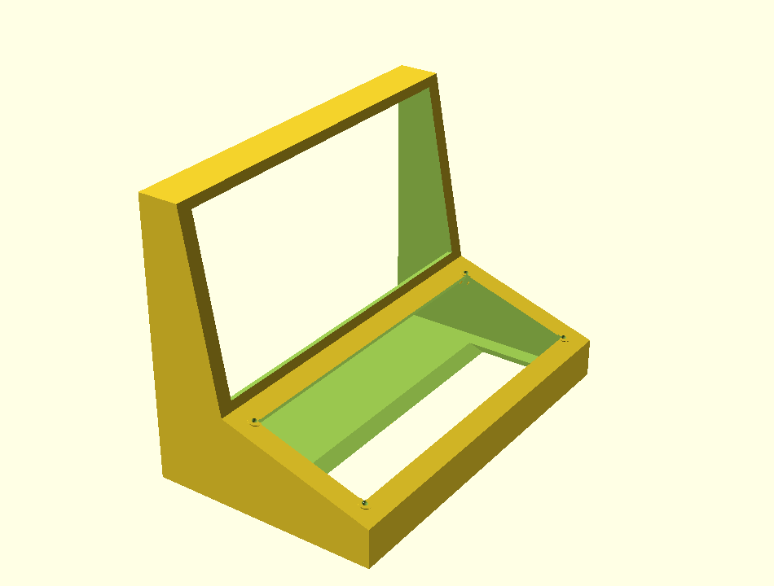

# Pixy enclosure

A wedge cabinet. The LED panel leans back ~10°, the control deck slopes ~18°
toward the player. Three printed parts, none needing supports.



## Parts

| Part | Size (mm) | Material | Orientation |
|---|---|---|---|
| `body` | 127 × 210 × 156 | ~194 g | On its **back face**, flat on the bed |
| `deck` | 83 × 203 × 3 | ~60 g | Flat |
| `back` | 203 × 153 × 3 | ~99 g | Flat |

Figures are 100% infill. At 20% with 3 perimeters expect roughly 40–50% of
that, so around **150 g** for the set.

**You need a 220 × 220 bed.** The widest part is 210 mm. Tell me if yours is
smaller and I'll add a split with alignment pins — `W` is parametric, but the
panel is 192 mm wide so the cabinet cannot shrink below about 206 mm.

## Print settings

- 0.2 mm layers, 3 perimeters, 20% infill
- No supports. Every overhang is either a wall or the ~18° deck, both fine
- Brim on `body` — it is tall with a modest footprint

## Assembly

1. **Panel** drops into the recess behind the screen aperture, from inside.
   The aperture is 4 mm smaller than the panel all round, so it seats against
   that lip and can't fall forward. Retain it with a dab of hot glue at each
   corner, or four small printed clips.
2. **Controls** push into the `deck` plate from behind: encoders through the
   7.6 mm holes with their own nuts, 12 mm tactiles into the big holes, 6 mm
   into the small pair, piezo behind the grille.
3. **Deck** sits on the ledge and screws down into the four bosses with M3 ×
   10. The plate sits proud by 3 mm — deliberate, so the ledge takes the load
   rather than the panel face.
4. **UNO Q and XIAO** mount inside on the base. There's room behind the deck.
5. **Back cover** screws on last. The vent slots sit over the UNO Q, and the
   cable exit at the bottom takes the panel's 5 V feed.

## Before you print

Three dimensions in the `.scad` are estimates I could not verify. Measure
yours and edit the top of the file — everything else derives from them.

```
panel_w = 192;   // confirmed from Waveshare's spec
panel_h = 96;    // confirmed
pcb_t   = 8;     // ESTIMATE  bare PCB depth
back_t  = 14;    // ESTIMATE  total depth including IDC connectors
```

`pcb_t` is the one that matters. Too small and the panel won't seat; too large
and it rattles. Measure the PCB alone, not including the connectors.

Also check `clear = 0.4`. That is the slip fit between printed parts — raise
it if your printer runs tight.

## Rendering

```bash
openscad -D 'part="body"' -o body.stl pixy_case.scad
openscad -D 'part="deck"' -o deck.stl pixy_case.scad
openscad -D 'part="back"' -o back.stl pixy_case.scad
```

Leave `part` unset to see all three laid out together.
